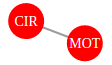
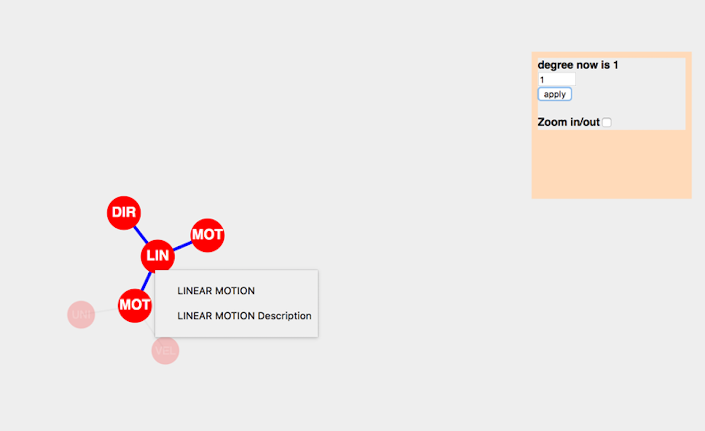
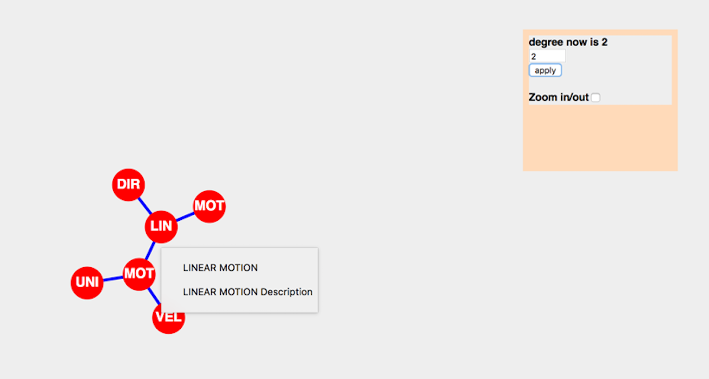

#How to use this app?

###What are the types of nodes and links?

1. There is 1 kind of node: LO (red).
1. There is 1 kind of link: Is_Prerequisite (grey).
1. ‘Is_Prerequisite’ link exists between 2 LOs.
1. Only 1 link can exist at most between any 2 nodes.

Here is an example

###How to interpret the graph?

* ‘LOs’ are represented by individual nodes (circles) having ‘RED’ color.

* ‘Prerequisite’ links are represented by edges (lines) having ‘GREY’ color.

* When a node is hovered upon, depending on the current degree, all ‘links’ are highlighted with ‘BLUE’ color (here current node is ‘LIN’). The prerequisite LOs retain their ‘RED’ color.

Degree is nothing but the number of *lower levels* (of prerequisites) of the current node that are highlighted.

**Degree is 1**

**Degree is 2**

