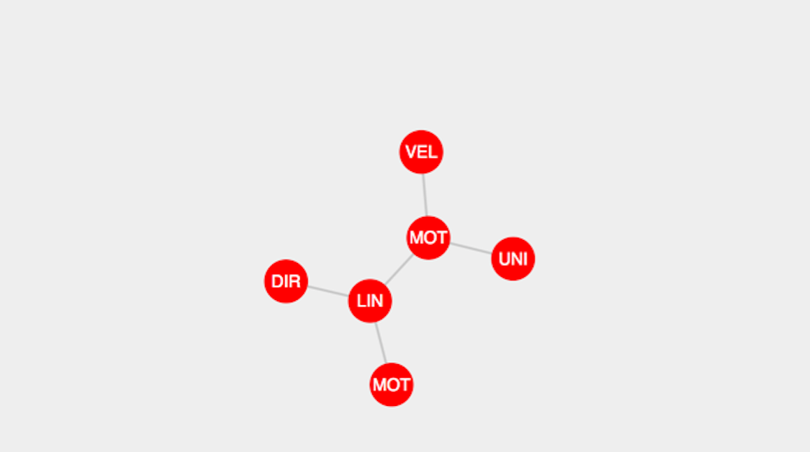

# Welcome to 'Atlas of Learning' Documentation

The GitHub repository for this project can be viewed [here](https://github.com/SidShenoy/Atlas-of-Learning).

##Features of the graph

*  Hover fade.
*  Hover highlight.
*  Drag and drop.
*  Single-click to open an overlay in the current node's context.
*  Double-click for centre alignment of the current node.
*  Hover content box.
*  Zoom in/out and pan checkbox.
*  Checkbox to show/hide graph.
*  Ability to change the global degree of all nodes (number of levels that will get highlighted upon hover).

To check out a live example, click [here](http://bl.ocks.org/SidShenoy/e13385b034d903976f34083b87be8794).

##Configurations (recommended and preferably should not be changed)

*  Single-click and double-click are distinguished by a 500 msec time-gap between successive clicks( < 500 for double-click,> 500 for single-click).

*  Single-click and drag-drop are also distinguished by a similar time-gap as above. This means that if a user drags and drops a node in less than 500 msec, then it is considered a 'single-click' event.

*  To complete a single 'mouseover' and 'mouseleave' successive pair event, a time-gap of 100 msec is used. This means that a 2 successive mouse-hovers on 2 different nodes will take place with the expected behaviour only if they differ by 100 msec. If not, unexpected behaviour may take place and the user is advised to refresh the page.
