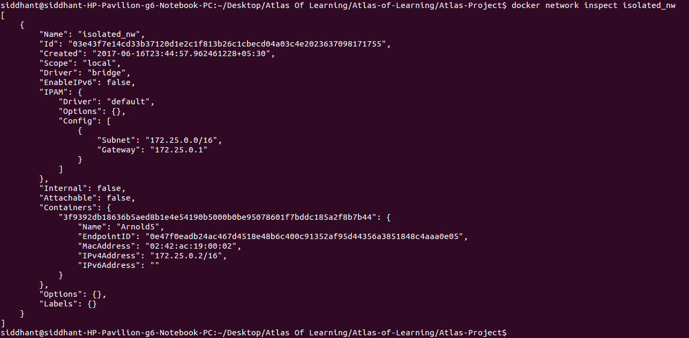
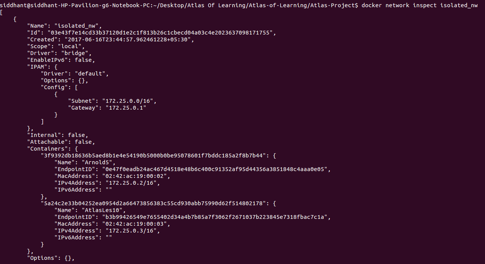

#Installation steps using docker

`1.` First, make sure docker is installed. If not click [here](https://docs.docker.com/engine/installation/linux/ubuntu/)

`2.` Now, create a new *docker network* using the following command:
```bash
$ docker network create -d bridge <name of network>
```
e.g.
```bash
$ docker network create -d bridge isolated_nw
```

`3.` Download the *neo4j* image and run a container on it.

e.g. Let the name of the container be 'neo4jCon'

`4.` Add the container to the network created in step `2.` using

```bash
$ docker network connect <name of network> <name of container>
```

e.g.
```bash
$ docker network connect isolated_nw neo4jCon
```

`5.` Check if the container was successfully added to the network using

```bash
$ docker network inspect <name of network>
```

e.g.
```bash
$ docker network inspect isolated_nw
```

Something like the following should be displayed to indicate successful addition:



In my case, I named the **neo4j** container as `Arnold5`.

Make a note of the `IPv4Address` of the added container, in the above case, it is `172.25.0.2`. The `/16` can be ignored.

`6.` Create a new folder anywhere on your file system. Go to that folder using `cd`.

`7.` Inside the new folder paste the *Dockerfile* along with the actual project folder, which is *Atlas of Learning*

Now when `ls` is executed you should be able to see that there is one folder named **Atlas of Learning** and a file named **Dockerfile**.

`8.` Your neo4j container will serve a neo4j database. This database has a `USERNAME` and `PASSWORD`.

Change these 2 values in the `Dockerfile` in lines 8 and 9.
In my case they were 'neo4j' and 'HBCSE' respectively.

```
ENV NEO4J_USERNAME=neo4j
ENV NEO4J_PASSWORD=HBCSE
```

Also take the `IPv4Address` we got in step `5.` and change the value in line 9.
Append the port `:7474` to the above `IP`.

e.g. In my case it was `172.25.0.2`. And after appending the final value is `172.25.0.2:7474`. Let the `http://` protocol remain the same.

```
ENV GRAPHENEDB_URL="http://172.25.0.2:7474"
```

Save the changes made to the `Dockerfile` before proceeding.

`9.` Now use the `docker build` command to create an image from the *Dockerfile* and give the image a name.

```bash
$ docker build -t <repo name>:<version> .
```

e.g.
```bash
$ docker build -t aol:version8 .
```

`10.` Now we will create the final docker container on the image created in step `9.` When we use the `docker run` command, an additional tag `--network=<name>` must be used as follows:

```bash
$ docker run -it -d --network=<name of network> --name=<name for container> -p 5000:5000 <repo name>:<version> python /home/Atlas_of_learning/run.py
```

e.g.
```bash
$ docker run -it -d --network=isolated_nw --name=AtlasLes10 -p 5000:5000 aol:version8 python /home/Atlas_of_learning/run.py
```

`11.` Thats it! You are good to go! Just check if the final container is running along with the neo4j container on the same network using `docker network inspect`.
e.g.
```bash
$ docker network inspect isolated_nw
```

You should be able to see something like this:



In my case, I named the **ATLAS** container as `AtlasLes10`.

`12.` You can start using the app in your browser at **localhost:5000**
